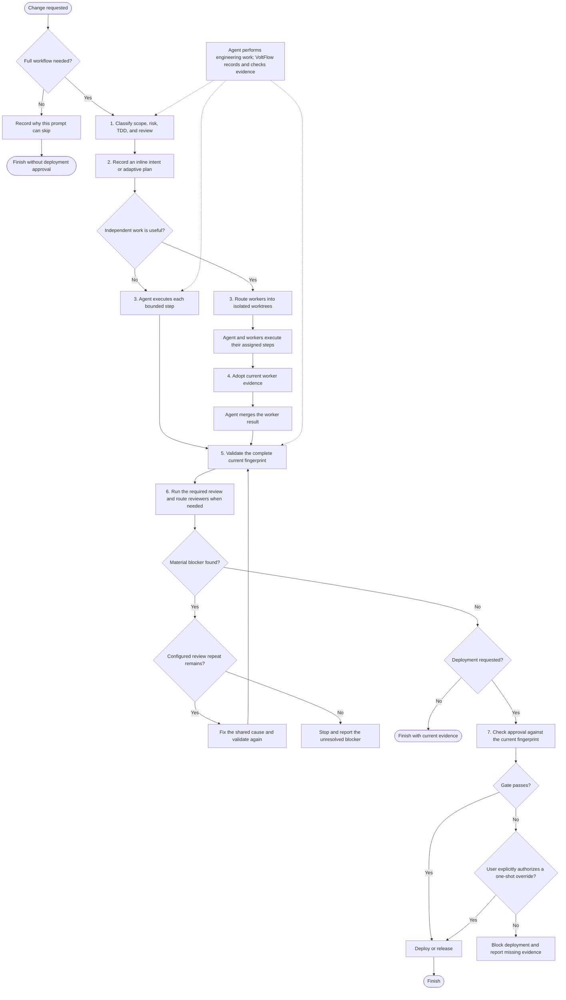

# VoltFlow

VoltFlow is a local workflow and policy layer for Codex. It scales planning, test-first development, delegation, and review to the risk of a change, then checks recognized deployment commands against approval for the current code.

Codex still does the engineering work. It writes code, runs tests, creates worktrees, merges branches, and cleans them up. VoltFlow supplies the workflow rules, records evidence in protected plugin state, checks supported tool calls, and decides whether the deployment gate passes.

## Why use it

Coding agents can move quickly, but speed creates a few predictable problems: production code appears before a failing test, validation becomes stale after another edit, parallel workers mix evidence, and a deploy starts from a diff that nobody reviewed.

VoltFlow addresses those problems without forcing the same process onto every task.

| Problem | VoltFlow's response |
| --- | --- |
| A small edit gets buried in process | Simple, low-risk work can skip the full workflow before editing |
| Production code changes before the bug is reproduced | TDD-required workflows block production edits until VoltFlow sees RED evidence |
| Tests or reviews no longer match the files on disk | Validation and approval are tied to the current Git fingerprint |
| Parallel workers lose scope or mix evidence | Each linked worktree keeps separate RED, validation, and review state |
| Review turns into an open-ended search for perfection | Reviewer guidance defines a material blocker, and adaptive plans can cap fix cycles |
| A deploy starts without current approval | Recognized deploy commands are checked against a local, fingerprint-bound gate |

## How it works



The diagram shows the full path. "Agent executes each bounded step" means RED to GREEN slices when TDD is required, or the closest useful check when TDD is exempt. Trivial work may use a short inline intent instead of a stored plan. Prose-only or similarly low-risk work can skip the workflow entirely when there is no deployment intent.

### 1. Classify the work

Before the first edit, the agent selects a risk tier, TDD mode, and review mode.

| Tier | Typical use | Planning | Minimum review |
| --- | --- | --- | --- |
| `trivial` | One obvious, low-risk change | Inline intent | Self-review |
| `standard` | A bounded feature or fix | Adaptive plan | One composite reviewer |
| `high` | Security, migration, concurrency, destructive data work, or several coupled parts | Adaptive plan | Two independent review lanes |

An active workflow can move to a higher tier. It cannot move to a weaker tier or review mode to avoid a gate.

TDD is classified separately:

- `required` applies when behavior changes and a test or runnable reproduction can prove it.
- `exempt` applies to prose, generated output, inert metadata, and work with no executable test seam. Exempt work still needs the closest useful validation.

A simple, low-risk task with no executable behavior or deployment intent can use `skip` before any change. Skipping removes the workflow checks for that prompt, but it never grants deployment approval.

### 2. Plan in proportion to risk

Standard and high workflows store an adaptive plan in protected session state. A plan can describe dependencies, parallel lanes, stop conditions, and capped repeats. `status --workflow` reports which steps are ready and shows linked worktrees with their agent bindings and missing evidence.

The plan is coordination data. It does not run commands, create worktrees, approve a review, or bypass any gate. The agent performs those actions.

Plans change only when the evidence changes the work. The agent can update one step with `plan --step` instead of rewriting the whole plan.

### 3. Build one behavior at a time

For TDD-required work, VoltFlow expects this loop:

1. Write one focused test and run it.
2. Confirm that it fails for the expected reason.
3. Make the smallest production change that passes that test.
4. Run the focused test and the relevant regression set.
5. Remove only the duplication or complexity exposed by that slice.
6. Repeat for the next behavior.

Within the hooked Codex tool flow, VoltFlow allows test edits before RED and blocks production edits until it has observed a failing test or the agent has recorded a manual reproduction. Editing tests later clears the current production-edit authorization, while preserving the fact that the workflow reached RED.

VoltFlow also watches supported shell and edit tools after they run. That lets it invalidate evidence when files change outside a dedicated edit tool. A successful, directly executed test command can record automated validation. Wrapper or setup failures cannot pretend to be RED.

### 4. Delegate only useful work

VoltFlow does not spawn subagents itself. The main Codex agent decides whether parallel work will help, chooses a model and reasoning effort for each assignment, and calls the host's subagent API.

Assignments have a bounded outcome, owned paths, required evidence, and a stop condition. VoltFlow's routing guidance chooses capability by difficulty, ambiguity, risk, and how easy the result is to verify. It applies to implementation workers and reviewers.

When workers use linked Git worktrees:

- The main agent creates the worktree, branch, and assignment.
- The worker inherits the active tier, TDD mode, review mode, and adaptive plan.
- RED, validation, review, and approval remain local to that worktree.
- The worker binds its agent ID by running the injected `status` command from its assigned worktree.
- Unchanged wait results do not justify cutting scope. The parent follows up when the worker reports a blocker or exceeds its stop condition.
- The main agent removes the worktree and branch when they are no longer needed.

Before merging, the main agent runs `integrate --from <worker-worktree>`. VoltFlow accepts only current, validated evidence from a linked worktree in the same workflow. The agent still performs the Git merge. Because the merge changes the integration worktree, validation and review must run again there.

### 5. Validate the result people will use

Validation must match the claim. A syntax check proves syntax, not runtime behavior. A unit test may prove a function while missing a browser crash. When a change affects a user-facing web flow, VoltFlow's instructions require one real browser interaction at a supported viewport or a clear statement that browser behavior remains unverified.

Validation is tied to the current Git fingerprint. The fingerprint covers workspace file content, executable mode bits, submodules, and configured ignored inputs. Staging or committing unchanged content keeps the same fingerprint. A material file change makes earlier validation and review stale.

### 6. Review the current fingerprint

Review depth follows the tier:

- Trivial work uses a self-review with recorded evidence.
- Standard work uses one independent composite reviewer.
- High work uses separate correctness/security and validation/scope reviewers.

Independent reviews use one-time lane tokens bound to the assigned fingerprint. A review receipt is accepted only for its assigned lane and unchanged files. Any edit invalidates the receipt.

A finding blocks completion when it is reproducible in ordinary supported use and breaks the requested behavior, a repository rule, or a material safety boundary. Adaptive plans may give a review step a repeat cap; when they do, the agent must stop at that limit. VoltFlow's reviewer guidance also tells the agent not to reopen validated work for speculative improvements.

### 7. Gate deployment

VoltFlow checks recognized deployment and release commands against approval for the current fingerprint. The gate normally passes when a matching self-review or independent review receipt exists.

Users can explicitly direct VoltFlow to deploy or release despite a missing gate. That override works once and only for the current fingerprint. Questions, hypotheticals, negated requests, and ordinary deploy instructions do not create an override.

The deployment gate is local. Hook coverage depends on the Codex tool surface, and `PreToolUse` cannot intercept every possible side effect. Put the controller's `gate` command immediately before the provider's deploy command in the same local wrapper when the boundary matters. VoltFlow does not produce a portable signed receipt for remote CI.

## What VoltFlow controls

The distinction matters:

| VoltFlow and its hooks | The Codex agent |
| --- | --- |
| Require workflow classification before managed edits | Choose the correct tier and scope |
| Block managed production edits before RED when TDD is required | Write tests and production code |
| Track plans and worktree-local evidence in protected plugin state | Decide which plan steps to run |
| Invalidate validation and review when the fingerprint changes | Run tests, browser checks, and other validation |
| Issue and verify fingerprint-bound review assignments | Spawn reviewers and respond to findings |
| Check recognized deployment commands | Create, merge, and remove branches and worktrees |

VoltFlow is a guardrail around an agent-run engineering process. It is not a CI service, task scheduler, Git client, autonomous deployment system, or substitute for repository permissions.

## Install

VoltFlow requires Node.js 20 or newer and Git.

Add the Team Volt marketplace and install the plugin:

```sh
codex plugin marketplace add Team-Volt/voltflow
codex plugin add voltflow@team-volt
```

Start a new Codex task, run `/hooks`, inspect the VoltFlow hook commands, and trust them. Codex loads newly installed skills and hooks when a new task starts.

To update VoltFlow, refresh the marketplace snapshot and reinstall the plugin:

```sh
codex plugin marketplace upgrade team-volt
codex plugin add voltflow@team-volt
```

Restart Codex after the update so new tasks load the current hooks and skill.

VoltFlow stores session state under protected `PLUGIN_DATA`; it does not add workflow ledgers to the target repository. If a sandboxed controller command cannot reach that directory, rerun the exact command with external permission. Do not copy approval state into the worktree or a temporary directory.

## Use it

Once installed, ask Codex to implement, fix, review, or prepare a change for deployment. The prompt hook gives the agent the exact controller path, data directory, and session ID for the task.

Examples:

```text
Implement this parser fix with VoltFlow.
Review this branch with VoltFlow.
Prepare this service for deployment with VoltFlow.
```

VoltFlow starts enabled in each session. These commands change the session setting:

```text
/voltflow off
/voltflow on
/voltflow status
```

Turning VoltFlow off disables its workflow hooks and deployment blocking for that session.

## Controller reference

The agent normally receives complete controller commands from the prompt hook. The command names are:

| Command | Purpose |
| --- | --- |
| `start` | Set the tier, TDD mode, and review mode |
| `skip` | Record why a simple prompt does not need the full workflow |
| `red` | Record a manual failing test or reproduction |
| `plan` | Create an adaptive plan or update one step |
| `status` | Show state, ready plan steps, worktrees, and missing evidence |
| `validate` | Record validation for the current fingerprint |
| `integrate` | Adopt validated evidence from a linked worker worktree |
| `review` | Create a fingerprint-bound independent review assignment |
| `approve` | Record self-review evidence when self-review is allowed |
| `gate` | Check whether the current fingerprint may deploy |

Run `node <plugin-root>/scripts/voltflow.mjs --help` for the current argument forms.

## Project-specific deployment surfaces

VoltFlow recognizes common package publishing, cloud deployment, infrastructure apply, release, and container push commands. Projects can add command or tool matchers in `.voltflow.json`:

```json
{
  "deployPatterns": ["^make promote$"],
  "deployTools": ["^mcp__cloud__promote$"],
  "fingerprintPaths": ["dist/release-manifest.json"]
}
```

`deployPatterns` and `deployTools` are case-insensitive regular expressions. `fingerprintPaths` lists exact relative paths for ignored files that must affect the fingerprint; directories and globs are not expanded. Invalid configuration is reported to the agent, and command execution fails closed until the configuration is fixed.

## Multi-agent v2

VoltFlow supports both host subagent schemas. Multi-agent v2 allows direct model and reasoning controls when the active Codex installation exposes them.

To enable v2:

```toml
[features.multi_agent_v2]
enabled = true
hide_spawn_agent_metadata = false
tool_namespace = "agents"
```

Remove a top-level `model_catalog_json` entry if it points to a v1 catalog, then restart Codex and open a new task. VoltFlow requires v2 subagents to use `fork_turns: "none"` so explicit model and reasoning settings remain valid.

The full routing rules are in [skills/voltflow/references/routing.md](skills/voltflow/references/routing.md).

## Development

```sh
npm test
```

## License

[MIT](LICENSE)
